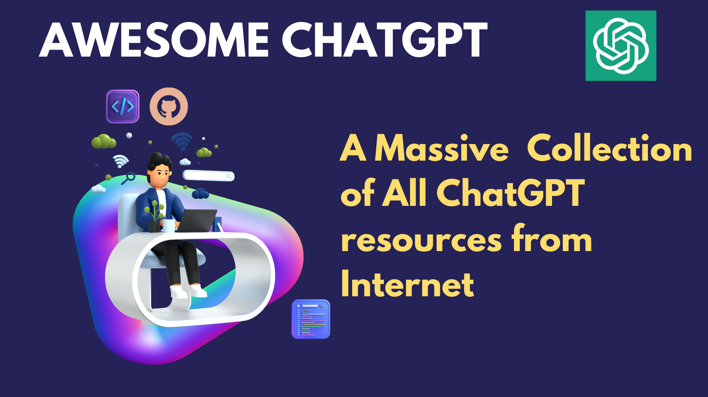

<h1>🧠 Awesome-ChatGPT | Massive Resources &amp; Collection On The Internet</h1>

Welcome to the "Awesome ChatGPT Resources" repository! This is a collection of all the latest tools that are out there.

The [ChatGPT](https://chat.openai.com/chat) model is a large language model trained by [OpenAI](https://openai.com) that is capable of generating human-like text. By providing it with a prompt, it can generate responses that continue the conversation or expand on the given prompt.

In this repository, you will find a variety of tools and solutions that can be used with ChatGPT.

To get started, you can do the following:
1. **Participate**: Join me in updating this as more folks add more cool tools powered by GPT.
2. **Clone or Fork it**: Simply clone or fork this repository if you like and follow it while we keep this updated for you.
3. **And, Star it 🌟 please** : We would appreciate if you can show your love ❤️ 🙂

---

# Official Resources

- [ChatGPT app](https://chat.openai.com/)
- [ChatGPT overview](https://openai.com/blog/chatgpt/)
- [ChatGTP Discord](https://discord.com/invite/openai)
- [OpenAI API Documentation](https://beta.openai.com/docs)
- [chatGPT launch blog](https://openai.com/blog/chatgpt/)

# Developer Libraries, SDKs, and APIs

## Python

1. [ChatGPT](https://github.com/acheong08/ChatGPT): Lightweight package for interacting with ChatGPT’s API by OpenAI. Uses reverse engineered official API
2.	[PyChatGPT](https://github.com/rawandahmad698/PyChatGPT): zap Python client for the unofficial ChatGPT API with auto token regeneration, conversation tracking, proxy support and more.
3. [chatgpt-api](https://github.com/taranjeet/chatgpt-api): This repo is unofficial ChatGPT api. It is based on Daniel Gross’s WhatsApp GPT
4.	[chatgpt-wrapper](https://github.com/mmabrouk/chatgpt-wrapper): API for interacting with ChatGPT using Python and from Shell.
5. [chatGPT-discord-bot](https://github.com/Zero6992/chatGPT-discord-bot): Integrate ChatGPT into your own discord bot
6.	[chatgpt-python](https://github.com/labteral/chatgpt-python): Unofficial Python SDK for OpenAI’s ChatGPT
7. [TextRL](https://github.com/voidful/TextRL): Reinforcement learning in text generation with transformers - Implementation of ChatGPT RLHF (Reinforcement Learning with Human Feedback)
8.	[stackexplain](https://github.com/shobrook/stackexplain): Explain your error message with ChatGPT
9.	[gtp3-wordpress-post-generator](https://github.com/nicolaballotta/gtp3-wordpress-post-generator): A simple cli to generate WordPress posts using Gpt3 starting from a topic.
10. [emailGPT](https://github.com/lucasmccabe/emailGPT): a quick and easy interface to generate emails with ChatGPT
11.	[docGPT](https://github.com/cesarhuret/docGPT): ChatGPT directly within search Google Docs as an Editor Add-on
12.	[chatgpt-conversation](https://github.com/platelminto/chatgpt-conversation): Have a conversation with ChatGPT using your voice, and have it talk back.
13. :cn: [Openaibot](https://github.com/sudoskys/Openaibot): OpenAI Chat Bot For Telegram
14. :cn: [chatgpt-mirai-qq-bot](https://github.com/lss233/chatgpt-mirai-qq-bot): OpenAI ChatGPT for Mirai QQ Bot
15. :cn: [QChatGPT](https://github.com/RockChinQ/QChatGPT): QQ robot bot developed based on OpenAI ChatGPT
16.	 :cn: [nonebot-plugin-chatgpt](https://github.com/A-kirami/nonebot-plugin-chatgpt): Smart Conversation Chat plugin for NoneBot2.
17. :cn:[ChineseAiDungeonChatGPT](https://github.com/bupticybee/ChineseAiDungeonChatGPT): AI dungeon using ChatGPT as the storytelling model

## JavaScript

1. [chatgpt-mac](https://github.com/vincelwt/chatgpt-mac): ChatGPT for Mac, living in your menubar.
2. [chatgpt-advanced](https://github.com/qunash/chatgpt-advanced): A browser extension that augments your ChatGPT prompts with web results.
3. [summarize.site](https://github.com/clmnin/summarize.site): Summarize web pages using OpenAI ChatGPT
4. [ChatGPT-ProBot](https://github.com/oceanlvr/ChatGPT-ProBot): A GPTChat based GitHub robot. dialogue/CR/etc…
5. [YouTube_Summary_with_ChatGPT](https://github.com/kazuki-sf/YouTube_Summary_with_ChatGPT): YouTube Summary with ChatGPT is a simple Chrome Extension (manifest v3) that allows you to get both YouTube video transcripts and summary of the video with OpenAI’s ChatGPT AI technology.
6. :cn: [wechat-bot](https://github.com/wangrongding/wechat-bot); a WeChat bot based on OpenAi ChatGPT + WeChaty that can be used to help you automatically reply to WeChat messages, or manage WeChat groups/friends, detect zombie fans, etc…

## Golang

1. [aiac](https://github.com/gofireflyio/aiac): Artificial Intelligence Infrastructure-as-Code Generator.
2. [openaigo](https://github.com/otiai10/openaigo): OpenAI (ChatGPT) API Client for Go
3. [whatsapp-gpt](https://github.com/danielgross/whatsapp-gpt) 2: WhatsApp bot that uses Golang with a multichat option (chatgpt chatting with chatgpt).
4. [beelzebub](https://github.com/mariocandela/beelzebub): A secure honeypot framework low code, extremely easy to configure by yaml
5. [wechatgpt](https://github.com/houko/wechatgpt): wechat chatgpt bot

## Rust

1. [chatgpt-desktop](https://github.com/sonnylazuardi/chatgpt-desktop): OpenAI ChatGPT desktop app for Mac, Windows, & Linux menubar using Tauri & Rust

## Typescript

1. [chatgpt-raycast]https://github.com/abielzulio/chatgpt-raycast): ChatGPT raycast extension
2. [chatgpt-twitter-bot](https://github.com/transitive-bullshit/chatgpt-twitter-bot): Twitter bot powered by OpenAI’s ChatGPT.
3. [tweetGPT](https://github.com/yaroslav-n/tweetGPT): TweetGPT is a chrome extension that generates tweets and replies using chatGPT

## Kotlin

Kotlin
1. [chatgpt-android](https://github.com/skydoves/chatgpt-android): ChatGPT Android demonstrates OpenAI’s ChatGPT on Android with Stream Chat SDK for Compose.

## Swift

1. [new-man](https://github.com/weykon/new-man): New Man is a MacOS native app as a popover view for easy searching and asking.

# Browser Extensions

1. [chatgpt-google-extension](https://github.com/wong2/chatgpt-google-extension) - A browser extension that enhance search engines with ChatGPT.
ChatGPT response alongside search Google Search results.
3. [ChatGPT-Google](https://github.com/ZohaibAhmed/ChatGPT-Google)  - Chrome Extension that Integrates ChatGPT (Unofficial) into search Google Search.
4. [chatgpt-advanced](https://github.com/qunash/chatgpt-advanced)  - A browser extension that augments your ChatGPT prompts with web results.
5. [chatgpt-chrome-extension](https://github.com/gragland/chatgpt-chrome-extension)  - A ChatGPT Chrome extension. Integrates ChatGPT into every text box on the internet.
6. [ChatGPT-Assistant](https://github.com/pdparchitect/ChatGPT-Assistant)  - A powerful extension that enhances your browsing experience on the ChatGPT website, with features like page fetching and more.
7. [ChatGPT-pdf](https://github.com/liady/ChatGPT-pdf)  - A Chrome extension for downloading your ChatGPT history to PNG, PDF or a sharable link.
8. [ChatGPT_Extension](https://github.com/kazuki-sf/ChatGPT_Extension)  - A really simple Chrome Extension (manifest v3) that you can access OpenAI’s ChatGPT from anywhere on the web.
9. [chat-gpt-search-extension](https://github.com/Doragd/chat-gpt-search-extension)  - A browser extension to display ChatGPT response alongside Search results (fork from wong2 and develop continually).
10. [chat-gpt-assistant](https://github.com/msfrisbie/chat-gpt-assistant)  - A browser extension to integrate ChatGPT everywhere.
11. [chatgpt-extension](https://github.com/iOliverNguyen/chatgpt-extension)  - This extension loads ChatGPT in the current tab, allowing you to use ChatGPT along your working session. Simply click the extension icon in your browser toolbar to activate ChatGPT or use the shortcut Ctrl + \ .
12. [chat-gpt-soliloquy](https://github.com/yetone/chat-gpt-soliloquy)  - A Chrome extension that allows ChatGPT to engage in a conversation with itself.
13. [ChatGPT for Search Engine](https://github.com/josStorer/chatGPT-search-engine-extension)  - A browser extension to display ChatGPT response alongside Search Engine results, supports Chrome/Edge/Firefox.
14. [assistant-chat-gpt](https://github.com/idosal/assistant-chat-gpt)  - A Chrome browser extension that embeds ChatGPT as a hands-free voice assistant.
15. [tweetGPT](https://github.com/yaroslav-n/tweetGPT)  - A chrome extension that generates tweets and replies using chatGPT.
16. [YouTube_Summary_with_ChatGPT](https://github.com/kazuki-sf/YouTube_Summary_with_ChatGPT)  - A simple Chrome Extension (manifest v3) that allows you to get both YouTube video transcripts and summary of the video with OpenAI’s ChatGPT AI technology.
17. [gpt-best-chrome](https://github.com/rileytomasek/gpt-best-chrome)  - Chrome extension for saving ChatGPT threads using gpt.best.
18. [ChatGPT-API-agent](https://github.com/ChatGPT-Hackers/ChatGPT-API-agent)  - ChatGPT API Agent (Firefox version).
19. [hey-addy-chatgpt](https://github.com/MichaelVandi/hey-addy-chatgpt)  - Email assistant powered by ChatGPT.
19. [GPT-Cookies](https://github.com/itsbrex/GPT-Cookies)  - Chrome Extension to easily copy your ChatGPT cookies + user-agent to clipboard with one click.
20. [ChatGPT History](https://github.com/benf2004/ChatGPT-History)  - A browser extension that allows you to save your ChatGPT conversation history. With this extension, you can easily review your past conversations and refer to them at a later time.
21. [chat-gpt-jupyter-extension](https://github.com/TiesdeKok/chat-gpt-jupyter-extension)  - A browser extension to provide various AI helper functions in Jupyter Notebooks, powered by ChatGPT.
22. [Chat-GPT-for-Gmail](https://github.com/dtkdt100/Chat-GPT-for-Gmail)  - A browser extension to complete your email with the help of ChatGPT.
23. [ChatGPT-SelfChat](https://github.com/vitaminwater/ChatGPT-SelfChat)  - Stupid browser extension to make two instances of GPT chat together.
24. [chatgpt-to-notion](https://github.com/L-a-r-t/chatgpt-to-notion)  - ChatGPT to Notion brings the cleverness of ChatGPT right into your Notion workspace!

25. [chatgpt-review-rebuttal-extension]()  - A browser extension for generating reviews and rebuttals in openreview, powered by ChatGPT.
26. [bing-chat-for-all-browsers]()  - Bing ChatGPT on Chrome and Firefox.
27. [chatgpt-google-summary-extension]()  - A browser extension to display ChatGPT Summary search results alongside search Google results.

## Chrome

1. [ChatGPT_Extension](): ChatGPT Extension is a really simple Chrome Extension (manifest v3) that you can access OpenAI’s ChatGPT from anywhere on the web.
2. [chat-gpt-google-extension](): A browser extension to display ChatGPT response alongside search engine results.
3. [ChatGPT-pdf](): A Chrome extension for downloading your ChatGPT history to PNG, PDF or a sharable link
4. [assistant-chat-gpt](): A Chrome browser extension that embeds ChatGPT as a hands-free voice assistant
5. [sharegpt](): Easily share permanent links to ChatGPT conversations with your friends
6. [chatgpt-advanced](): A browser extension that augments your ChatGPT prompts with web results.
7. [tweetGPT](): TweetGPT is a chrome extension that generates tweets and replies using chatGPT
8. [YouTube_Summary_with_ChatGPT](): YouTube Summary with ChatGPT is a simple Chrome Extension (manifest v3) that allows you to get both YouTube video transcripts and summary of the video with OpenAI’s ChatGPT AI technology.

## Firefox

1. [chat-gpt-google-extension](): A browser extension to display ChatGPT response alongside search engine results.

## Additional Tools Extensions

1. [chatgpt-vscode]() - A VSCode extension that allows you to use ChatGPT.
2. [chatgpt.nvim]() - A Neovim plugin that lets you query ChatGPT inside a Neovim buffer.
3. [chatgpt-raycast]() - Unofficial ChatGPT raycast extension.
4. [docGPT]()- ChatGPT directly within search Google Docs as an Editor Add-on.
5. [vscode-chatgpt]() - A search Visual Studio Code extension to support ChatGPT. The extension is pair-programmed with ChatGPT.
6. [chatgpt-vscode-plugin]() - A VS code plugin for ChatGPT built by ChatGPT.
7. [ChatGPT.nvim]() - Neovim plugin for interacting with OpenAI GPT-3 chatbot, providing an easy interface for exploring GPT-3 and NLP.
8. [vim-chatgpt]()- Vim plugin for ChatGPT
9. [MenuChatGPT - ChatGPT as a status bar item for macOS
10. [ExplainThisCode]() - A VSCode extension that uses the ChatGPT API to provide explanations for selected code.
11. [ChatGPT-Gnome-Desktop-Extension]() - ChatGPT Gnome Desktop Extension | Talk with ChatGPT from your menubar!
12. [ScribeAI]() - ChatGPT extension for VSCode.

# Integrations

## Terminal
[ai-cli](): Get answers for CLI commands from GPT3 right from your terminal
## NeoVim
[ChatGPT.nvim](): Neovim plugin for interacting with OpenAI GPT-3 chatbot, providing an easy interface for exploring GPT-3 and NLP.
## WhatsApp
1. [whatsapp-gpt](): WhatsApp bot that uses Golang with a multichat option (chatgpt chatting with chatgpt).
2. [chatgpt-api](): This repo is unofficial ChatGPT api. It is based on Daniel Gross’s WhatsApp GPT
## Telegram
[chatgpt-telegram-bot-serverless](): ChatGPT Telegram Bot running in AWS Lambda
## Slack
[ChatGPTSlackBot](): A Slack bot that integrates with OpenAI’s ChatGPT to provide answers, written in Python
## Discord
1. [chatgpt-discord](): Run your own GPTChat Discord bot, with a single command!
2. [chatGPT-discord-bot](): Integrate ChatGPT into your own discord bot
## VSCode
[chatgpt-vscode](): A VSCode extension that allows you to use ChatGPT
search 

## Google Docs
[docGPT](): ChatGPT directly within search Google Docs as an Editor Add-on
## JetBrains IDE
[intellij-chatgpt](): A ChatGPT plugin for IntelliJ Platform-Based IDEs
## Wordpress
- [gtp3-wordpress-post-generator](): A simple cli to generate WordPress posts using Gpt3 starting from a topic.
## Raycast
[chatgpt-raycast](): ChatGPT raycast extension
## WeChat
1. :cn: [wechat-bot](): a WeChat bot based on OpenAi ChatGPT + WeChaty that can be used to help you automatically reply to WeChat messages, or manage WeChat groups/friends, detect zombie fans, etc…
2. :cn: [wechatgpt](): wechat chatgpt bot
## Prompts
[awesome-chatgpt-prompts](): A curated list of ChatGPT prompts
showgpt.co 8: Curated ChatGPT prompts